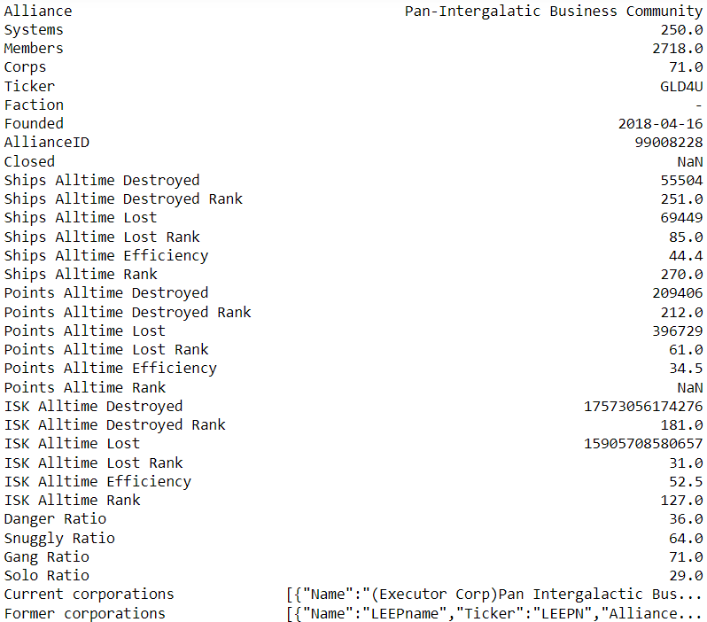
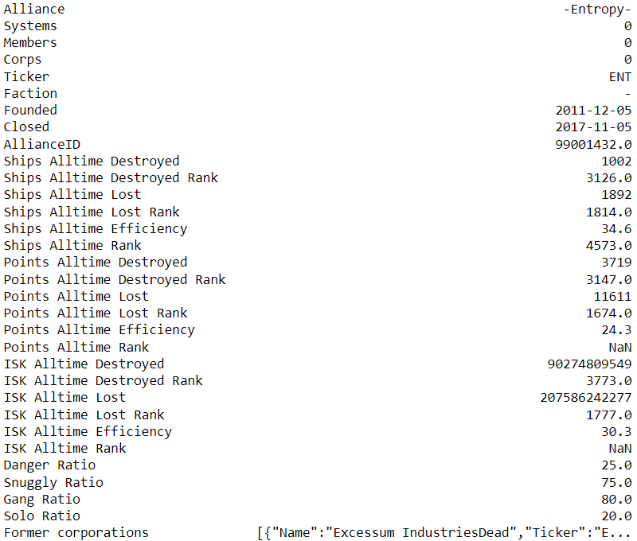

# EVE Online Community Collapse

Investigating changes in communities via social network analysis.

<https://docs.google.com/document/d/1PXu5z1oYBpi1YlBRdaRNK0TkEVLO7s0n7uly0T-suT8/edit#>

Collaborators:

- Aron Lindberg
- Jingyi Sun
- Adam Coscia

## Data

Date scraped: 12/16/2022

Missing/NaN values indicate that value was corrupted or not present in the data.

- 3106 alive alliances
- 12090 dead alliances
- 31 top-level attributes, 1 observation per attribute per alliance
  - Alliance
  - Systems
  - Members
  - Corps
  - Ticker
  - Faction
  - Founded
  - AllianceID
  - Closed
  - Ships Alltime Destroyed
  - Ships Alltime Destroyed Rank
  - Ships Alltime Lost
  - Ships Alltime Lost Rank
  - Ships Alltime Efficiency
  - Ships Alltime Rank
  - Points Alltime Destroyed
  - Points Alltime Destroyed Rank
  - Points Alltime Lost
  - Points Alltime Lost Rank
  - Points Alltime Efficiency
  - Points Alltime Rank
  - ISK Alltime Destroyed
  - ISK Alltime Destroyed Rank
  - ISK Alltime Lost
  - ISK Alltime Lost Rank
  - ISK Alltime Efficiency
  - ISK Alltime Rank
  - Danger Ratio
  - Snuggly Ratio
  - Gang Ratio
  - Solo Ratio
- 2 nested attributes, n observations with 4/6 attributes per alliance
  - Current corporations
    - Name
    - Ticker
    - Member
    - Joined
  - Former corporations
    - Name
    - Ticker
    - Alliance (now)
    - Member
    - Joined
    - Left

### Alive alliance example

### Dead alliance example

